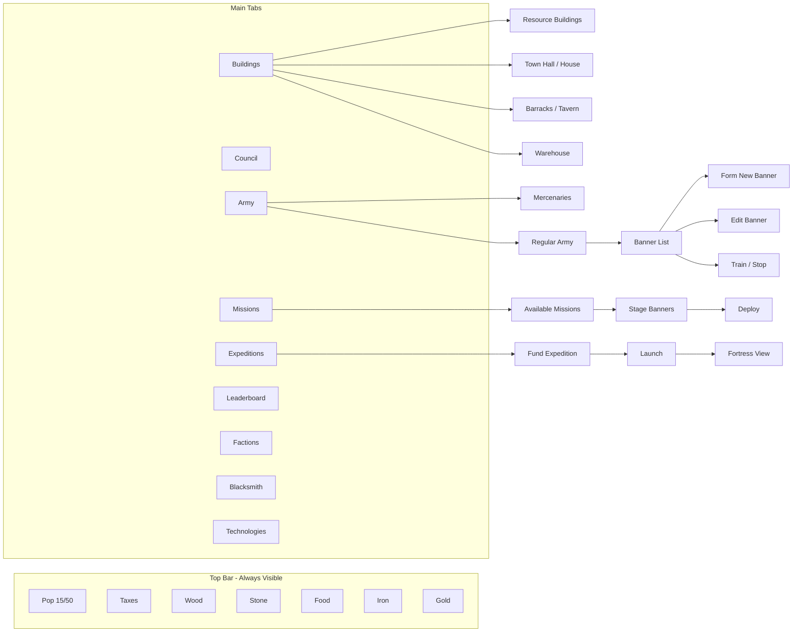
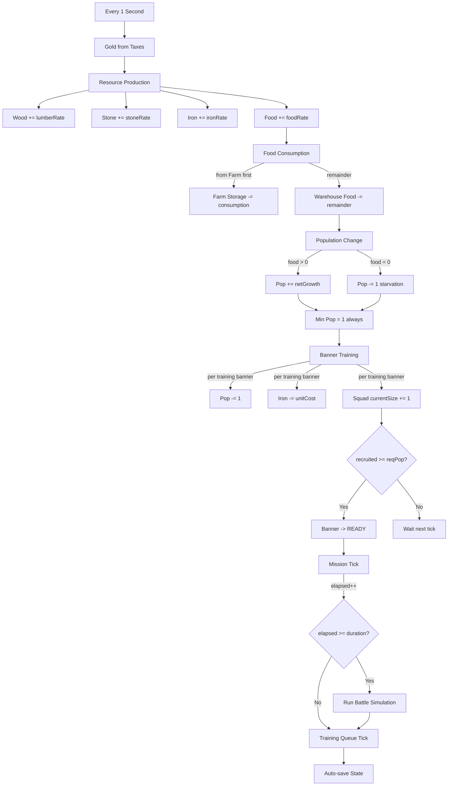
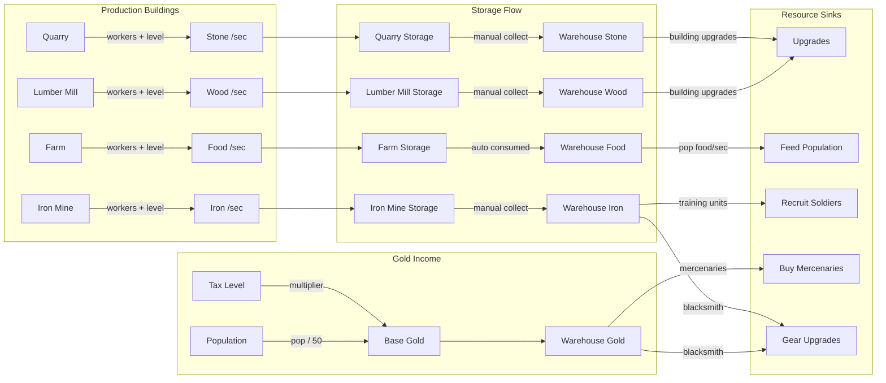
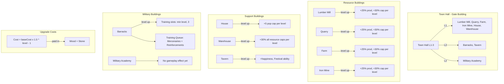
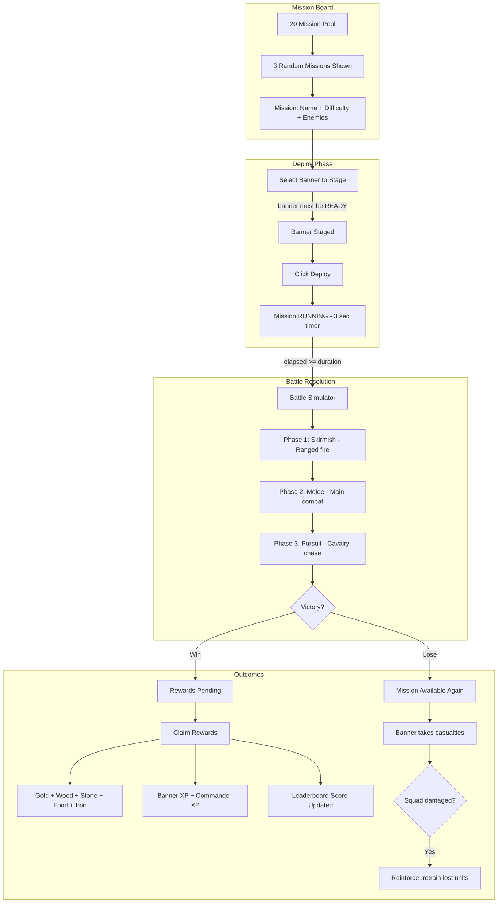
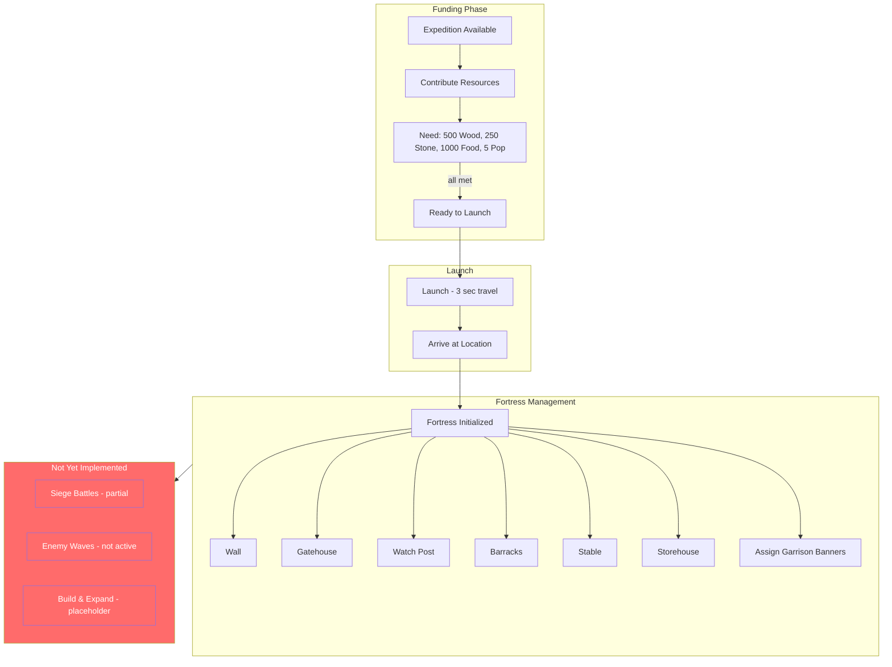
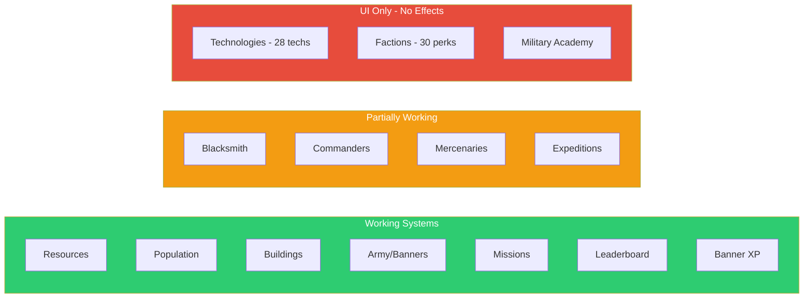

# ZUNDRAL — Game Flowcharts (Current State)

---

## 1. NAVIGATION FLOW

---

## 2. GAME LOOP (1 tick = 1 second)

---

## 3. RESOURCE SYSTEM

---

## 4. BUILDING SYSTEM

---

## 5. RECRUITING / MILITARY SYSTEM

```mermaid
graph TD
    subgraph BANNER_CREATION[Create Banner]
        NEW[+ Form New Banner] --> EMPTY[Empty Banner - 8 squad slots]
        EMPTY --> PICK[Pick Unit Type per Slot]
        PICK --> |Pikemen, Warrior, Archer...| SQUAD[Squad: 0/10]
    end

    subgraph TRAINING[Training Flow]
        IDLE[Banner IDLE] --> |click Train| TRAINING_S[Banner TRAINING]
        TRAINING_S --> |each second| CONSUME[Pop -= 1, Iron -= cost]
        CONSUME --> FILL[Squad currentSize += 1]
        FILL --> CHECK{All squads 10/10?}
        CHECK --> |No| CONSUME
        CHECK --> |Yes| READY_S[Banner READY]
    end

    subgraph UNIT_TYPES[Unit Types Available]
        INF[Infantry]
        INF --> MILITIA[Militia - Free, weak]
        INF --> PIKE[Pikemen - Anti-cavalry]
        INF --> WARRIOR[Warrior/Shieldmen - Balanced]
        INF --> LONG[Longsword - Elite melee]

        RNG[Ranged]
        RNG --> ARCHER[Archer - Cheap ranged]
        RNG --> SKIRM[Skirmisher - Hybrid]
        RNG --> CROSS[Crossbowmen - Elite ranged]

        CAV[Cavalry]
        CAV --> LCAV[Light Cavalry - Fast]
        CAV --> HCAV[Heavy Cavalry - Heavy hitter]
    end

    subgraph MERCENARIES[Mercenary System]
        GOLD_PAY[Pay 50 Gold] --> TEMPLATE[Pick Template]
        TEMPLATE --> T1[Bloody Warriors - 8 Warrior squads]
        TEMPLATE --> T2[Archers - 8 Archer squads]
        TEMPLATE --> T3[Mixed - 4 Warrior + 4 Archer]
        T1 --> ARRIVE[Arrives via Queue]
        T2 --> ARRIVE
        T3 --> ARRIVE
        ARRIVE --> MERC_READY[Banner READY - instant]
    end

    subgraph COMMANDERS[Commander System]
        RECRUIT_CMD[Recruit Commander] --> CMD[Commander]
        CMD --> |assign to banner| BONUS[Attack/Defence Bonus]
        CMD --> ARCH1[Ranged Specialist: +20% ranged]
        CMD --> ARCH2[Melee Specialist: +20% melee]
        CMD --> ARCH3[Balanced: +10% both]
        CMD --> |gains XP from battles| LEVEL_UP[Level 1-99]
    end
```

---

## 6. MISSION SYSTEM

---

## 7. EXPEDITION SYSTEM (Partial)

---

## 8. SYSTEMS STATUS OVERVIEW

